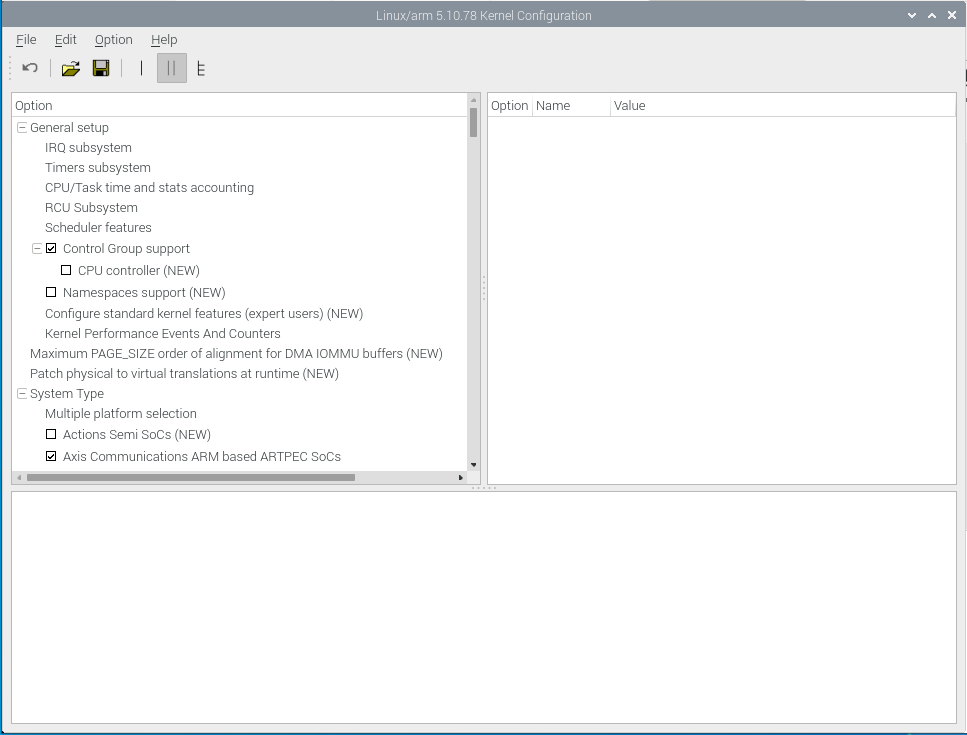

_______________________________________________________

# INSTRUCTIONS FOR INSTALLING KERNEL AND DEVICE DRIVERS

_______________________________________________________

This guide will show you how to download, install and build a custom version of the Linux Kernel on a Raspberry Pi - specofically a RPi4.

**Note**: A prerequisite for the following tutorial is to have a working OS already installed on the Pi such as Raspberry Pi OS (formerly Raspian).  
&nbsp;

&nbsp;

&nbsp;
1). From the home directory of your Pi, create a new directory called `linux` and navigate to new directory - should look like the below:

&nbsp;

&nbsp;

&nbsp;

2). From here, we will download the Linux kernel files using the following command:  

**`git clone --depth=1 https://github.com/raspberrypi/linux`**  

This will create a directory named linux which should look similiar to this:
  
&nbsp;

&nbsp;

&nbsp;

3). Once we have downloaded the kernel, we will download some prerequisite packages that will assist with building the kernel:

**`sudo apt install raspberrypi-kernel-headers build-essential bc git wget bison flex libssl-dev make`**
&nbsp;

&nbsp;

&nbsp;

4). Next, we will generate the default kernel configuration. This is done from the root directory of the linux kernel:  

**`KERNEL=kernel7l`
`make bcm2711_defconfig`**
&nbsp;

&nbsp;

&nbsp;

5). Now we have the config built, we can now begin customising what is included as part of the kernel. The most simple way to do this is from a GUI.  

Here we have the option to use either `X-Config` (via qt5) or `menuconfig` (via ncurses). 

As both of these options use a GUI for interacting with options, you will need to have a connection to the RPi that has a display rather than a command line. The most common way to do this is with a VNC setup.

In this example, [tightvnc](https://www.tightvnc.com/) is connected to the Pi via my Windows device.  
&nbsp;

5a). For the X-config option:

**`sudo apt-get install qt5-\*-dev`**

And to start it:

**`make xconfig`**

Example below:  

  
&nbsp;

5b). For the menuconfig option:

**`sudo apt install ncurses\*-dev`**

And to start it:

**`make menuconfig`**

Example below:  

  
